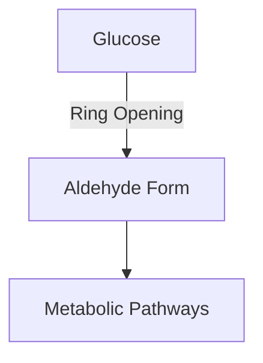

import Tabs from '@theme/Tabs';
import TabItem from '@theme/TabItem';

> Aldehydes are **fundamental carbonyl compounds** in organic chemistry characterized by a terminal C=O group. These molecules serve as **essential building blocks** in organic synthesis, natural product chemistry, and biochemical processes, playing crucial roles from industrial polymer production to cellular metabolism.

---

## 🧪 Basic Structure and Properties

Aldehydes contain a carbonyl group (C=O) at the terminal position of a carbon chain, making them uniquely reactive due to their electronic and structural features.

<Tabs>
<TabItem value="structure" label="Structure">

### 🔍 Electronic Structure

The carbonyl group creates distinct reactivity patterns due to:

1. **Electronic Distribution**:
   - The C=O bond is polarized due to oxygen's electronegativity
   - The carbonyl carbon is electrophilic
   - The oxygen holds a partial negative charge

2. **Resonance Effects**:
   $$
   \text{R-CH}=\text{O} \leftrightarrow \text{R-CH}^+-\text{O}^-
   $$

:::tip Key Properties
- **Boiling Points**: Higher than corresponding hydrocarbons due to dipole-dipole interactions
- **Solubility**: Smaller aldehydes are water-soluble due to hydrogen bonding
- **Reactivity**: Highly reactive toward nucleophilic addition
:::

</TabItem>

<TabItem value="spectroscopy" label="Spectroscopic Analysis">

### 📊 Spectroscopic Identification

1. **IR Spectroscopy**:
   - Strong C=O stretch at 1725-1740 cm⁻¹
   - Characteristic C-H aldehyde stretch near 2720 cm⁻¹ (Fermi resonance)

2. **NMR Spectroscopy**:
   - ¹H NMR: Distinctive downfield aldehyde proton (δ 9-10 ppm)
   - ¹³C NMR: Carbonyl carbon signal around δ 190-200 ppm

</TabItem>
</Tabs>

## 🌟 Major Reaction Types

### 🔍 1. Nucleophilic Addition Reactions


<Tabs>
<TabItem value="additions" label="Addition Reactions">

#### Common Nucleophilic Additions

1. **Grignard Reactions**:
   - RMgX adds to form secondary alcohols
   - Anhydrous conditions required
   $$
   \text{R-CH=O} + \text{R'-MgX} \rightarrow \text{R-CH(OH)-R'}
   $$

2. **Cyanohydrin Formation**:
   - CN⁻ adds to form cyanohydrins
   - Reversible process
   $$
   \text{R-CH=O} + \text{CN}^- \rightarrow \text{R-CH(OH)-CN}
   $$

:::tip Important Considerations
- Temperature control is crucial
- Product stability varies with substrate
- Water-sensitive reactions require anhydrous conditions
:::

</TabItem>

<TabItem value="mechanisms" label="Reaction Mechanisms">

#### Mechanism Details

1. **Initial Attack**:
   - Nucleophile approaches the electrophilic carbonyl carbon
   - Forms tetrahedral intermediate

2. **Proton Transfer**:
   - Protonation of alkoxide intermediate
   - Forms final product

</TabItem>
</Tabs>

### 🔍 2. Oxidation and Reduction

<Tabs>
<TabItem value="oxidation" label="Oxidation">

#### Oxidation to Carboxylic Acids

- **Reagents**:
  - Cr(VI) oxidants (K₂Cr₂O₇)
  - KMnO₄
  - Ag₂O (Tollen's reagent)

```mermaid
graph LR
    A[Aldehyde] -->|[O]| B[Carboxylic Acid]
```

</TabItem>

<TabItem value="reduction" label="Reduction">

#### Reduction to Primary Alcohols

- **Reagents**:
  - NaBH₄ (mild, selective)
  - LiAlH₄ (strong, less selective)
  - H₂/catalyst (hydrogenation)

:::tip Selectivity
- NaBH₄ reduces C=O but not esters
- LiAlH₄ reduces multiple functional groups
:::

</TabItem>
</Tabs>

## 💡 Industrial Applications

### Key Uses and Products

1. **Polymer Chemistry**:
   - Formaldehyde in phenol-formaldehyde resins
   - Polyurethane production

2. **Fragrance Industry**:
   - Vanillin (vanilla fragrance)
   - Benzaldehyde (almond scent)

### Biochemical Significance



:::tip Biological Roles
- Sugar metabolism
- Protein modification through Maillard reaction
- Neurotransmitter synthesis
:::

## ⚠️ Safety and Handling

1. **Storage**:
   - Cool, well-ventilated areas
   - Protected from air and oxidants

2. **Disposal**:
   - Proper neutralization required
   - Environmental considerations

:::warning Important Safety Notes
- Many aldehydes are volatile
- Some are carcinogenic (e.g., formaldehyde)
- Proper PPE required for handling
:::
