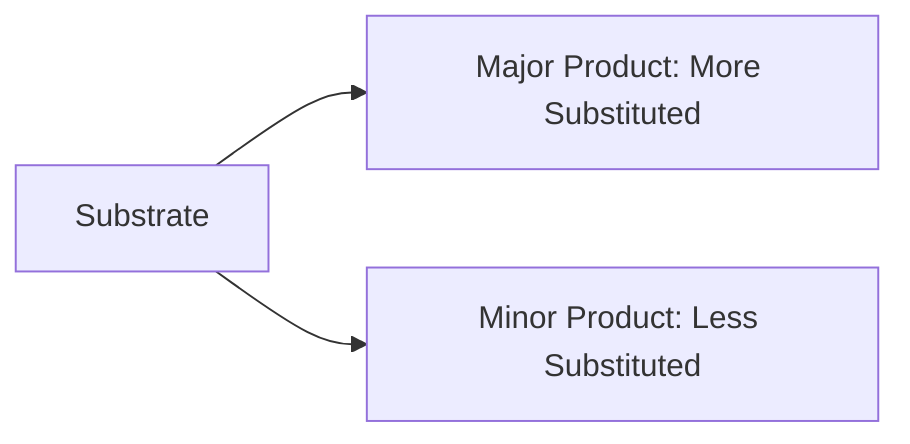

> Elimination reactions are **fundamental processes** in organic chemistry where a molecule loses two substituents to form a multiple bond, such as a double or triple bond. These reactions are indispensable in **organic synthesis**, enabling the creation of alkenes and alkynes, which are key building blocks in a variety of chemical and industrial applications.

---

## 🧪 Types of Elimination Reactions

Elimination reactions can proceed through two primary mechanisms: **E1 (Elimination Unimolecular)** and **E2 (Elimination Bimolecular)**. These mechanisms differ in their kinetics, stereochemical requirements, and reaction conditions.

### 🔍 E1 Mechanism: Elimination Unimolecular

The **E1 mechanism** unfolds in two distinct steps:

1. **Formation of a Carbocation Intermediate (Rate-Determining Step)**:
   - The leaving group departs first, creating a carbocation.
   - This step is slow, as it requires overcoming the energy barrier to form a high-energy intermediate.

2. **Proton Loss and Alkene Formation**:
   - A base abstracts a proton (β-hydrogen) from the adjacent carbon atom.
   - The electrons from the broken C–H bond form the π bond, creating the alkene.

$$alplh$$

### ⚖️ Comparison of E1 vs. E2 Mechanisms

| Feature                       | **E1**                                | **E2**                           |
| ----------------------------- | ------------------------------------- | -------------------------------- |
| **Mechanism**                 | Two steps (formation of intermediate) | One step (concerted)             |
| **Kinetics**                  | First-order                           | Second-order                     |
| **Base Requirement**          | Weak base                             | Strong base                      |
| **Solvent Preference**        | Polar protic                          | Polar aprotic                    |
| **Stereochemistry**           | Not stereospecific                    | Stereospecific (anti-periplanar) |
| **Carbocation Rearrangement** | Possible                              | Not possible                     |

---

### 💡 Did You Know?

- **E1 and E2 Competition**: Tertiary substrates often favor E1 in polar protic solvents due to easier carbocation formation. However, in the presence of strong bases, E2 dominates.
- **Zaitsev's Rule in Both Mechanisms**: While E1 strictly follows Zaitsev's rule due to thermodynamic control, E2 reactions may deviate if bulky bases (like tert-butoxide) are used, favoring the less substituted product (Hofmann product).

## Factors Affecting Elimination Reactions

### 1. Substrate Structure
- Primary vs. Secondary vs. Tertiary substrates
- Leaving group ability
- Steric hindrance

### 2. Base Strength
```jsx
Strong Base → E2 favored
Weak Base → E1 possible
```

### 3. Solvent Effects
<div className="custom-table">

| Solvent Type  | Effect on Reaction |
| ------------- | ------------------ |
| Polar Protic  | Favors E1          |
| Polar Aprotic | Favors E2          |
| Non-polar     | Limited effect     |

</div>

## Competition with Substitution

Elimination reactions often compete with substitution reactions (SN1 and SN2).

:::warning Common Competition Scenarios
- E2 vs. SN2
- E1 vs. SN1
:::

## Regioselectivity and Stereochemistry

### Zaitsev's Rule
The major product is the more substituted alkene.



### Stereochemistry
- E2 requires anti-periplanar geometry
- E1 can form both E and Z isomers

## Applications in Synthesis

Elimination reactions are valuable in:
- Alkene synthesis
- Natural product synthesis
- Pharmaceutical manufacturing
- Polymer chemistry

## Practice Problems

:::note Exercise
1. Predict the major product when 2-bromopropane reacts with KOH in ethanol.
2. Compare the rates of E2 elimination for primary, secondary, and tertiary substrates.
:::

## Summary

Elimination reactions are essential transformations in organic chemistry that:
- Form π bonds from σ bonds
- Follow either E1 or E2 mechanisms
- Show predictable selectivity patterns
- Compete with substitution reactions

## Further Reading

- Advanced elimination mechanisms
- Synthetic applications
- Industrial processes
- Recent developments

:::tip Additional Resources
Visit our [reaction mechanisms](/)
:::