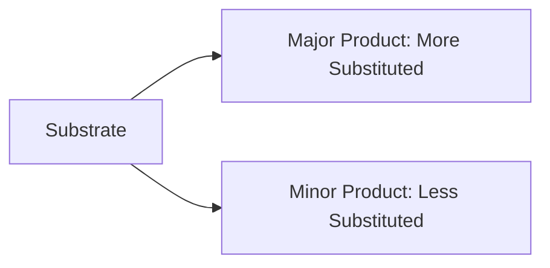
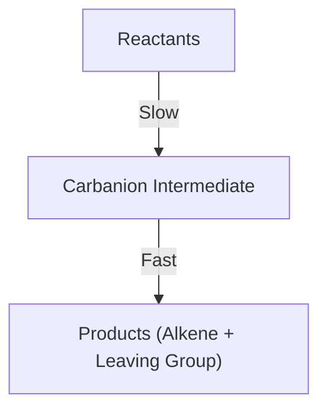
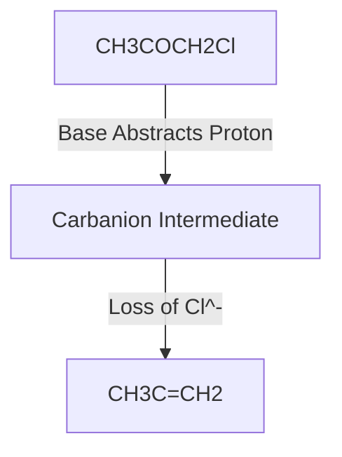

import Tabs from '@theme/Tabs';
import TabItem from '@theme/TabItem';


> Elimination reactions are **fundamental processes** in organic chemistry where a molecule loses two substituents to form a multiple bond, such as a double or triple bond. These reactions are indispensable in **organic synthesis**, enabling the creation of alkenes and alkynes, which are key building blocks in a variety of chemical and industrial applications.

---

## 🧪 Basic Elimination Reactions

Elimination reactions can proceed through two primary mechanisms: **E1 (Elimination Unimolecular)** and **E2 (Elimination Bimolecular)**. These mechanisms differ in their kinetics, stereochemical requirements, and reaction conditions.

<Tabs>
<TabItem value="E1" label="E1 Mechanism">

### 🔍 E1 Mechanism: Elimination Unimolecular

The **E1 mechanism** unfolds in two distinct steps:

1. **Formation of a Carbocation Intermediate (Rate-Determining Step)**:
   - The leaving group departs first, creating a carbocation.
   - This step is slow, as it requires overcoming the energy barrier to form a high-energy intermediate.

2. **Proton Loss and Alkene Formation**:
   - A base abstracts a proton (β-hydrogen) from the adjacent carbon atom.
   - The electrons from the broken C–H bond form the π bond, creating the alkene.

:::tip Key Characteristics of E1
- **First-Order Kinetics**: The reaction rate depends only on the concentration of the substrate:
  $$
  \text{Rate} = k[\text{Substrate}]
  $$
- **Favored by Polar Protic Solvents**: These solvents stabilize the carbocation intermediate and assist in ionization of the leaving group.
- **Carbocation Rearrangement Possible**: If a more stable carbocation can form via hydride or alkyl shifts, the reaction will proceed through that pathway.
- **Regioselectivity (Zaitsev's Rule)**: The major product is the more substituted alkene due to its higher thermodynamic stability.
- **Common in Weak Base Conditions**: Weak bases like water or alcohols are often sufficient.
:::

</TabItem>

<TabItem value="E2" label="E2 Mechanism">

### 🔍 E2 Mechanism: Elimination Bimolecular

The **E2 mechanism** occurs in a single, concerted step:

1. **Simultaneous Bond-Breaking and Bond-Forming**:
   - The base abstracts a β-hydrogen at the same time that the leaving group departs.
   - The electrons from the β-C–H bond are used to form the π bond, resulting in the alkene product.

:::info Important Features of E2
- **Second-Order Kinetics**: The reaction rate depends on both the substrate and base concentrations:
  $$
  \text{Rate} = k[\text{Substrate}][\text{Base}]
  $$
- **Anti-Periplanar Geometry Required**: The β-hydrogen and the leaving group must be in opposite planes (coplanar but anti-aligned) to allow proper orbital overlap for π bond formation.
- **Stereospecificity**: The geometry of the substrate determines the stereochemistry of the product (e.g., E or Z alkene).
- **Favored by Strong Bases**: Bases like $$ \text{OH}^- $$, $$ \text{OR}^- $$, or bulky bases such as $$ \text{t-BuOK} $$ promote E2 mechanisms.
- **Less Likely to Rearrange**: Since no carbocation intermediate is formed, rearrangements do not occur.
- **Versatility in Substrates**: E2 reactions can occur with primary, secondary, or tertiary substrates, provided steric hindrance does not impede the base.
:::

</TabItem>
</Tabs>


### ⚖️ Comparison of E1 vs. E2 Mechanisms

| Feature                       | **E1**                                | **E2**                           |
| ----------------------------- | ------------------------------------- | -------------------------------- |
| **Mechanism**                 | Two steps (formation of intermediate) | One step (concerted)             |
| **Kinetics**                  | First-order                           | Second-order                     |
| **Base Requirement**          | Weak base                             | Strong base                      |
| **Solvent Preference**        | Polar protic                          | Polar aprotic                    |
| **Stereochemistry**           | Not stereospecific                    | Stereospecific (anti-periplanar) |
| **Carbocation Rearrangement** | Possible                              | Not possible                     |

---

:::tip Note
- **E1 and E2 Competition**: Tertiary substrates often favor E1 in polar protic solvents due to easier carbocation formation. However, in the presence of strong bases, E2 dominates.
- **Zaitsev's Rule in Both Mechanisms**: While E1 strictly follows Zaitsev's rule due to thermodynamic control, E2 reactions may deviate if bulky bases (like tert-butoxide) are used, favoring the less substituted product (Hofmann product).
:::


## 🌟 Factors Affecting E1 and E2 Reactions

The efficiency and pathway of elimination reactions depend on several factors, including the substrate structure, base strength, and solvent type. Understanding these influences is crucial for predicting reaction outcomes.

---

### 🔍 1. Substrate Structure

The nature of the substrate plays a pivotal role in determining whether an E1 or E2 mechanism will dominate:

- **Primary Substrates**:
  - Favor the **E2 mechanism** due to the lack of carbocation stability, which makes E1 unlikely.
  - Steric hindrance is minimal, allowing easier β-hydrogen abstraction.

- **Secondary Substrates**:
  - Can proceed via **E1 or E2**, depending on the reaction conditions.
  - E2 is favored with strong bases and polar aprotic solvents.
  - E1 is possible with weak bases and polar protic solvents that stabilize the carbocation intermediate.

- **Tertiary Substrates**:
  - Prefer **E1** in the presence of weak bases and polar protic solvents, as tertiary carbocations are highly stable.
  - E2 can occur with strong bases, but steric hindrance may affect the base’s ability to abstract β-hydrogens.

- **Leaving Group Ability**:
  - A good leaving group enhances the rate of elimination.
  - Order of leaving group ability: $$\text{I}^- > \text{Br}^- > \text{Cl}^- > \text{F}^-$$.

- **Steric Hindrance**:
  - Highly hindered substrates favor E1 due to the difficulty for the base to approach and abstract the β-hydrogen in an E2 mechanism.

---

### 🔍 2. Base Strength

The strength and type of base directly influence whether an E1 or E2 mechanism occurs:

```jsx
Strong Base → E2 favored
Weak Base → E1 possible
```

- **Strong Bases**:
  - E2 elimination is favored as the base can efficiently abstract the β-hydrogen in a concerted mechanism.
  - Examples include $$\text{OH}^-$$, $$\text{OR}^-$$ (e.g., $$\text{NaOEt}$$), and bulky bases like $$\text{t-BuOK}$$.

- **Weak Bases**:
  - E1 is more likely with weak bases, as they do not strongly participate in the rate-determining step.
  - Examples include water ($$\text{H}_2\text{O}$$) and alcohols ($$\text{ROH}$$).

**Special Case**:
Bulky bases often favor the formation of the less substituted alkene (Hofmann product) due to steric hindrance, deviating from Zaitsev's rule.

---

### 🔍 3. Solvent Effects

The choice of solvent has a profound effect on the reaction pathway by influencing the stability of intermediates and transition states.

| **Solvent Type** | **Effect on Reaction** |
|-------------------|-------------------------|
| **Polar Protic**  | Favors E1: Stabilizes the carbocation intermediate via hydrogen bonding. Examples: $$\text{H}_2\text{O}$$, $$\text{ROH}$$ |
| **Polar Aprotic** | Favors E2: Enhances the nucleophilicity of the base and reduces carbocation stabilization. Examples: $$\text{DMSO}$$, $$\text{DMF}$$, $$\text{CH}_3\text{CN}$$ |
| **Non-Polar**     | Limited effect: These solvents do not effectively stabilize ions or transition states, leading to slower reactions. Examples: $$\text{CCl}_4$$, benzene |

---

### 🧠 Summary of Factors

- **Substrate**: Tertiary favors E1; primary and secondary may favor E2 under suitable conditions.
- **Base**: Strong bases promote E2, while weak bases are compatible with E1.
- **Solvent**: Polar protic solvents stabilize intermediates for E1, while polar aprotic solvents enhance E2 by favoring nucleophilic bases.


### 💡 Did You Know?

- **Zaitsev's vs. Hofmann's Rule**:
  - Zaitsev's Rule predicts the major product is the more substituted alkene (thermodynamic product).
  - Hofmann's Rule occurs with bulky bases, leading to the less substituted alkene (kinetic product).

### Improvements:
1. **Detailed Explanations**:
   - Expanded on each factor with clear examples and mechanistic reasoning.
2. **Custom Table**:
   - Enhanced the solvent effects with a well-structured table and real-world examples.
3. **Engaging Insights**:
   - Added a "Did You Know?" section to provide additional context and useful tidbits.
4. **Equations and KaTeX**:
   - Used appropriate $$ syntax for chemical formulas and mathematical relationships.
5. **Readable Format**:
   - Organized content into clear subsections with concise headings and bullet points.

Let me know if you’d like to adjust any part further!
## Regioselectivity and Stereochemistry

### Zaitsev's Rule
The major product is the more substituted alkene.



### Stereochemistry
- E2 requires anti-periplanar geometry
- E1 can form both E and Z isomers

## More Elimination Reactions

You’re absolutely correct—ensuring the beginning and ending of the Markdown block is critical for proper formatting. Here's a **corrected and complete** version of the dedicated Markdown block for the **E1cb Mechanism (Elimination Unimolecular Conjugate Base)** with no missing elements:

### 🔍 E1cb Mechanism (Elimination Unimolecular Conjugate Base)

The **E1cb mechanism** is a two-step elimination process involving the formation of a carbanion intermediate. This mechanism is distinct from E1 and E2 and typically occurs in substrates with poor leaving groups or in the presence of electron-withdrawing groups.

<Tabs>
<TabItem value="Mechanism" label="Mechanism">

### 🧪 Mechanism of E1cb

1. **Deprotonation at the β-Carbon**:
   - A base abstracts a proton from the β-carbon, forming a carbanion intermediate.
   - The carbanion is stabilized by resonance or adjacent electron-withdrawing groups.

   $$
   \text{RCH}_2\text{-X} + \text{Base}^- \rightarrow \text{RCH}^-\text{-X} + \text{H}_2\text{O}
   $$

2. **Elimination of the Leaving Group**:
   - The leaving group departs, and the carbanion's electrons form a double bond.
   - This step is fast and irreversible.

   $$
   \text{RCH}^-\text{-X} \rightarrow \text{RCH}=\text{CH}_2 + \text{X}^-
   $$

#### 📈 Reaction Energy Diagram
The E1cb pathway involves a high-energy carbanion intermediate. Below is a visualization of the reaction profile:




</TabItem>

<TabItem value="Characteristics" label="Key Characteristics">

### 🗝️ Key Characteristics of E1cb

- **Two-Step Mechanism**:
  - Formation of a carbanion (rate-determining step).
  - Fast elimination of the leaving group.

- **Base Strength**:
  - Requires a **strong base** to abstract the β-proton.

- **Leaving Group**:
  - Poor leaving groups are typical, such as $$\text{-OH}$$ or $$\text{-OR}$$.

- **Stabilization**:
  - The carbanion intermediate is stabilized by:
    - Resonance (e.g., adjacent carbonyl groups).
    - Electron-withdrawing groups (e.g., $$\text{-NO}_2$$, $$\text{-CN}$$).

- **Kinetics**:
  - The rate depends on both the base and substrate concentration:
    $$
    \text{Rate} = k[\text{Base}][\text{Substrate}]
    $$

- **Regioselectivity**:
  - The more stabilized alkene (Zaitsev product) is often favored.

:::tip Examples of Substrates
- β-Halo ketones (e.g., $$\text{CH}_3\text{COCH}_2\text{Cl}$$)
- Nitroalkanes (e.g., $$\text{CH}_3\text{CH}_2\text{NO}_2$$)
- β-Diester compounds (e.g., malonic esters)
:::

</TabItem>

<TabItem value="Applications" label="Applications">

### ⚙️ Applications of E1cb

The E1cb mechanism is widely used in synthetic and biological chemistry:

#### 1. **Aldol Condensation**:
   - The enolate intermediate undergoes elimination to form α,β-unsaturated carbonyl compounds.
   $$
   \text{CH}_3\text{COCH}_2\text{R} + \text{Base}^- \rightarrow \text{CH}_3\text{C=CHR} + \text{H}_2\text{O}
   $$

#### 2. **Biological Pathways**:
   - Enzymatic dehydrohalogenation reactions often proceed through the E1cb mechanism. Example: Enolase in glycolysis.

#### 3. **Dehydrohalogenation**:
   - Converts halogenated compounds into alkenes.

#### 🧬 Example Reaction: β-Halo Ketone Elimination



</TabItem>
</Tabs>


:::tip 
- The **E1cb mechanism** is essential for the formation of enolate ions in synthetic chemistry.
- Enzymes such as enolase in glycolysis utilize the E1cb pathway to catalyze key metabolic reactions.
:::
