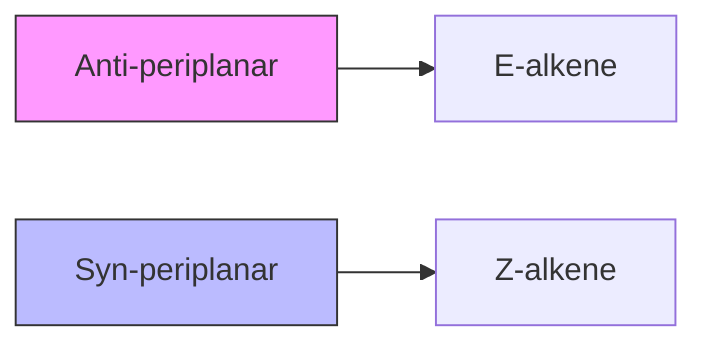
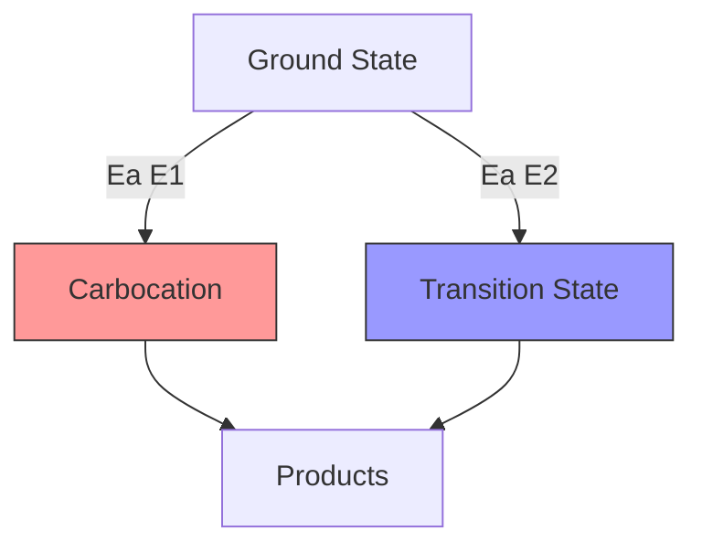

import Tabs from '@theme/Tabs';
import TabItem from '@theme/TabItem';

> Nucleophilic substitution reactions are fundamental processes in organic chemistry where a nucleophile replaces a leaving group. These reactions are crucial in organic synthesis and play a vital role in many biological processes. Understanding the mechanisms and factors that influence these reactions is essential for predicting and controlling chemical transformations.

---

## 🎯 Advanced Elimination Concepts

### 🔍 Competing Reaction Pathways

When multiple elimination pathways are possible, the product distribution depends on several factors:

1. **E1 vs. E2 Competition**:
   ```mermaid
   graph TD
       A[Substrate + Base] --> B[E1 Pathway]
       A --> C[E2 Pathway]
       B --> D[Products]
       C --> D
       style B fill:#f9f,stroke:#333
       style C fill:#bbf,stroke:#333
   ```

2. **E1 vs. SN1 Competition**:
   - Both mechanisms share a carbocation intermediate
   - Product ratio depends on:
     ```
     - Temperature (↑ temp favors elimination)
     - Base concentration
     - Substrate structure
     ```

3. **E2 vs. SN2 Competition**:
   - Controlled by:
     - Base structure (bulky bases favor E2)
     - Substrate accessibility
     - Temperature (↑ temp favors elimination)

### 🧪 Advanced Mechanistic Details

#### E1 Mechanism Deep Dive
:::info Carbocation Rearrangements
1. **Hydride Shifts**:
   $$
   \text{R}_3\text{C}^+ \xrightarrow{\text{1,2-H shift}} \text{R}_2\text{CH-CR}_2^+
   $$

2. **Alkyl Shifts**:
   $$
   \text{R}_3\text{C}^+ \xrightarrow{\text{1,2-R shift}} \text{R}_2\text{C-CR}_3^+
   $$
:::

#### E2 Stereochemical Requirements


## 🔬 Special Cases and Applications

### 1. Hofmann Elimination
:::tip Key Points
- Occurs with quaternary ammonium salts
- Forms less substituted alkene
- Mechanism:
  $$
  \text{R}_3\text{N}^+\text{CH}_2\text{CH}_3 + \text{OH}^- \rightarrow \text{R}_3\text{N} + \text{CH}_2=\text{CH}_2
  $$
:::

### 2. Cope Elimination
- Occurs in amine oxides
- Proceeds through a cyclic transition state
- Stereospecific syn elimination

### 3. Industrial Applications

| Process | Mechanism | Products | Conditions |
|---------|-----------|----------|------------|
| Ethylene Production | E2 | Ethylene | High temp, strong base |
| Dehydrohalogenation | E2/E1 | Various alkenes | Base-dependent |
| Petroleum Cracking | E1 | Mixed alkenes | High temp, catalyst |

## 🧮 Problem-Solving Strategies

### Predicting Major Products
1. **Analyze the Substrate**:
   - Structure (1°, 2°, 3°)
   - Leaving group
   - Available β-hydrogens

2. **Evaluate Conditions**:
   - Base strength
   - Solvent polarity
   - Temperature

3. **Consider Competing Pathways**:
   ```mermaid
   graph TD
       A[Starting Material] --> B[E1]
       A --> C[E2]
       A --> D[SN1]
       A --> E[SN2]
   ```

### Common Mistakes to Avoid
:::warning Common Pitfalls
1. Forgetting to check for rearrangements in E1
2. Ignoring stereochemical requirements in E2
3. Not considering competing nucleophilic substitution
4. Overlooking solvent effects
:::

## 🔋 Energy Considerations

### Activation Energy Profiles


### Thermodynamic vs. Kinetic Control
- **Thermodynamic Control** (E1):
  $$
  \Delta G°_\text{reaction} = -RT\ln K_\text{eq}
  $$
- **Kinetic Control** (E2):
  $$
  k = Ae^{-E_a/RT}
  $$

