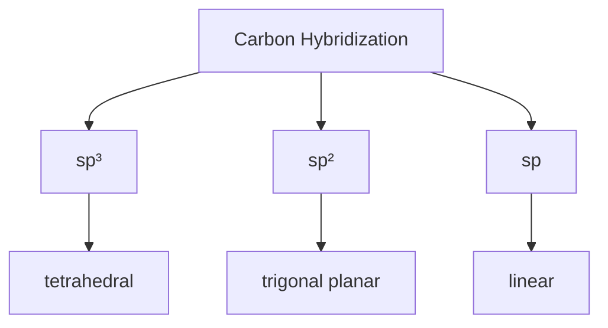

import Tabs from '@theme/Tabs';
import TabItem from '@theme/TabItem';

# Introduction to Organic Chemistry

Organic chemistry is the study of compounds containing carbon, particularly focusing on their structure, properties, composition, reactions, and synthesis. This field forms the foundation for understanding biological processes and modern materials.

:::tip Historical Note
The term "organic" originally implied these compounds could only come from living organisms. This view changed in 1828 when Friedrich Wöhler synthesized urea from inorganic compounds.
:::

## Fundamentals of Carbon Chemistry

Carbon's unique properties make it central to organic chemistry:

- Forms 4 stable covalent bonds
- Can bond with itself to form chains and rings
- Creates stable bonds with hydrogen, oxygen, nitrogen, and halogens
- Exhibits hybridization (sp³, sp², sp)

<Tabs>
<TabItem value="hybridization" label="Carbon Hybridization">

</TabItem>
<TabItem value="bonds" label="Bond Types">

| Bond Type | Example | Characteristics                 |
| --------- | ------- | ------------------------------- |
| Single    | C-C     | 347 kJ/mol, free rotation       |
| Double    | C=C     | 614 kJ/mol, restricted rotation |
| Triple    | C≡C     | 839 kJ/mol, linear geometry     |

</TabItem>
</Tabs>

## Functional Groups

:::info
Functional groups are specific atoms or combinations of atoms that define the chemical behavior of molecules.
:::

Common Functional Groups

| Group           | Structure | Example Compound | Key Properties       |
| --------------- | --------- | ---------------- | -------------------- |
| Alkyl           | R-CH₃     | Methane          | Nonpolar, unreactive |
| Alcohol         | R-OH      | Ethanol          | Polar, H-bonding     |
| Aldehyde        | R-CHO     | Formaldehyde     | Highly reactive      |
| Ketone          | R-CO-R    | Acetone          | Moderately reactive  |
| Carboxylic Acid | R-COOH    | Acetic acid      | Acidic, H-bonding    |
| Amine           | R-NH₂     | Methylamine      | Basic, H-bonding     |

## Reaction Mechanisms

Organic reactions are systematic processes where molecules transform through specific pathways. Understanding these mechanisms is crucial for predicting and controlling chemical reactions.

### Common Types of Mechanisms

<Tabs>
  <TabItem value="addition" label="Addition Reactions">

:::info Addition Mechanism
Addition reactions occur when two molecules combine to form a single product, typically across a double bond.

**Example Reaction:**
CH₂=CH₂ + H₂O → CH₃-CH₂OH

**Where:**
- CH₂=CH₂ (ethene) - starting material with a double bond
- H₂O (water) - attacking molecule
- CH₃-CH₂OH (ethanol) - final product

:::tip Key Points
- Involves breaking a π bond
- Forms two new σ bonds
- Common in alkenes and alkynes
:::

  </TabItem>
  <TabItem value="substitution" label="Substitution Reactions">

:::info Substitution Mechanism
Substitution reactions involve replacing one atom or group with another.

**Example Reaction:**
CH₃-Br + OH⁻ → CH₃-OH + Br⁻

**Where:**
- CH₃-Br (methyl bromide) - starting material
- OH⁻ (hydroxide ion) - nucleophile
- CH₃-OH (methanol) - product
- Br⁻ (bromide ion) - leaving group

:::tip Key Points
- One group replaces another
- Common in alkyl halides
- Can be SN1 or SN2 type
:::

  </TabItem>
</Tabs>

:::note
These mechanisms are fundamental to organic chemistry and form the basis for more complex reactions.
:::

## Applications in Modern Science

:::note
Organic chemistry applications span multiple fields:
:::

- **Pharmaceutical Industry**
  - Drug design and synthesis
  - Structure-activity relationships
  - Drug delivery systems

- **Materials Science**
  - Polymer synthesis
  - Smart materials
  - Organic electronics

- **Biochemistry**
  - Metabolism
  - Protein chemistry
  - Nucleic acid chemistry

## Advanced Topics

Further Areas of Study

- Stereochemistry
- Spectroscopy
- Retrosynthesis
- Organometallic chemistry
- Green chemistry
- Bioorganic chemistry

## Resources for Further Study

:::tip Recommended Reading
1. Organic Chemistry by Wade
2. Advanced Organic Chemistry by Carey
3. March's Advanced Organic Chemistry
:::